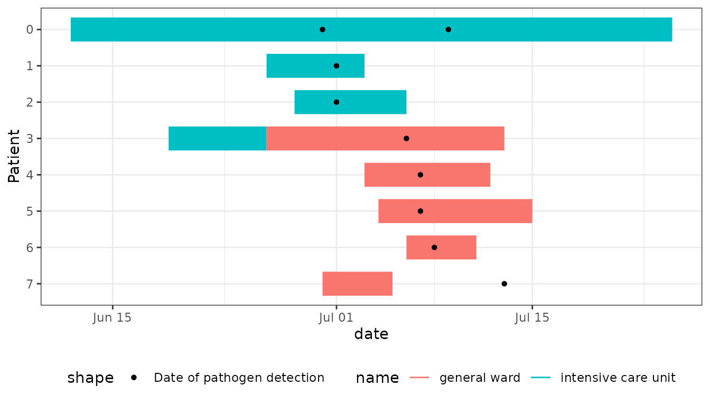
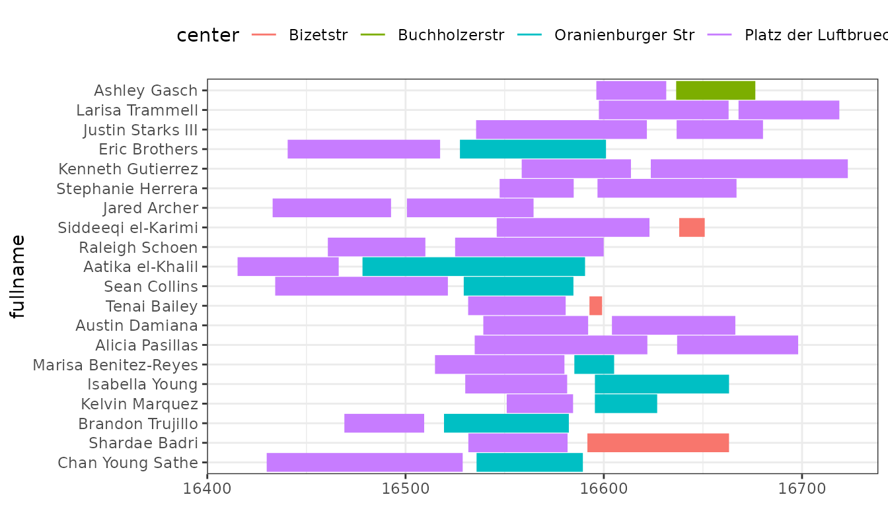
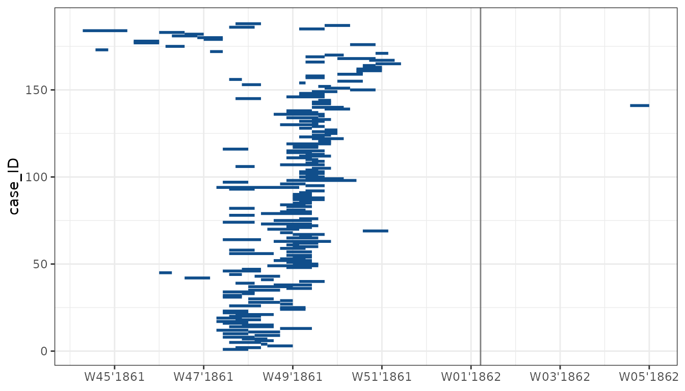

# EpiGantt: epigantt charts in ggplot with ggsurveillance

## EpiGantt examples

This vignette is still work in progress. But the examples are hopefully
already helpful and inspiring.

Epi Gantt plots are used to visualize exposure times in infectious
disease outbreaks. Hospital outbreaks are a common example for their
use. Lying times of patients on different wards can be visualized and
potential transmission routes identified. Like this:


### Start with the Line List

``` r

linelist_hospital_outbreak
#> # A tibble: 8 × 9
#>   Patient ward_name_1        ward_start_of_stay_1 ward_end_of_stay_1 ward_name_2
#>   <chr>   <chr>              <date>               <date>             <chr>      
#> 1 0       intensive care un… 2024-06-12           2024-07-25         NA         
#> 2 1       intensive care un… 2024-06-26           2024-07-03         NA         
#> 3 2       intensive care un… 2024-06-28           2024-07-06         NA         
#> 4 3       intensive care un… 2024-06-19           2024-06-26         general wa…
#> 5 4       general ward       2024-07-03           2024-07-12         NA         
#> 6 5       general ward       2024-07-04           2024-07-15         NA         
#> 7 6       general ward       2024-07-06           2024-07-11         NA         
#> 8 7       general ward       2024-06-30           2024-07-05         NA         
#> # ℹ 4 more variables: ward_start_of_stay_2 <date>, ward_end_of_stay_2 <date>,
#> #   pathogen_detection_1 <date>, pathogen_detection_2 <date>
```

### Transform the Line List into long format for ggplot

``` r

linelist_hospital_outbreak |>
  pivot_longer(
    cols = starts_with("ward"),
    names_to = c(".value", "num"),
    names_pattern = "ward_(name|start_of_stay|end_of_stay)_([0-9]+)",
    values_drop_na = TRUE
  ) -> df_stays_long
df_stays_long |> select(Patient, num:end_of_stay)
#> # A tibble: 9 × 5
#>   Patient num   name                start_of_stay end_of_stay
#>   <chr>   <chr> <chr>               <date>        <date>     
#> 1 0       1     intensive care unit 2024-06-12    2024-07-25 
#> 2 1       1     intensive care unit 2024-06-26    2024-07-03 
#> 3 2       1     intensive care unit 2024-06-28    2024-07-06 
#> 4 3       1     intensive care unit 2024-06-19    2024-06-26 
#> 5 3       2     general ward        2024-06-26    2024-07-13 
#> 6 4       1     general ward        2024-07-03    2024-07-12 
#> 7 5       1     general ward        2024-07-04    2024-07-15 
#> 8 6       1     general ward        2024-07-06    2024-07-11 
#> 9 7       1     general ward        2024-06-30    2024-07-05

linelist_hospital_outbreak |>
  pivot_longer(cols = starts_with("pathogen"), values_to = "date", values_drop_na = TRUE) -> df_detections_long
df_detections_long |> select(Patient, name, date)
#> # A tibble: 9 × 3
#>   Patient name                 date      
#>   <chr>   <chr>                <date>    
#> 1 0       pathogen_detection_1 2024-06-30
#> 2 0       pathogen_detection_2 2024-07-09
#> 3 1       pathogen_detection_1 2024-07-01
#> 4 2       pathogen_detection_1 2024-07-01
#> 5 3       pathogen_detection_1 2024-07-06
#> 6 4       pathogen_detection_1 2024-07-07
#> 7 5       pathogen_detection_1 2024-07-07
#> 8 6       pathogen_detection_1 2024-07-08
#> 9 7       pathogen_detection_1 2024-07-13
```

### Plot the Epigantt chart

``` r

ggplot(df_stays_long) +
  geom_epigantt(aes(y = Patient, xmin = start_of_stay, xmax = end_of_stay, color = name)) +
  geom_point(aes(y = Patient, x = date, shape = "Date of pathogen detection"), data = df_detections_long) +
  scale_y_discrete_reverse() +
  theme_bw() +
  theme_mod_legend_bottom()
```



## Outbreak 2: Fictional Varicella Outbreak in Berlin

``` r

outbreaks::varicella_sim_berlin |>
  filter(center1 == "Platz der Luftbruecke") |>
  arrange(onset) |>
  slice_head(n = 20) |>
  mutate(
    fullname = paste(firstname, lastname),
    fullname = factor(fullname, levels = rev(fullname))
  ) |>
  pivot_longer(
    cols = starts_with(c("arrival", "leave", "center")),
    names_to = c(".value", "group"),
    names_pattern = "(\\w+)(\\d+)"
  ) |>
  ggplot(aes(y = fullname)) +
  geom_epigantt(aes(xmin = arrival, xmax = leave, colour = center), lw_scaling_factor = 100) + # linewidth = 4
  # geom_point(aes(x = onset)) +
  scale_x_date() +
  theme_bw() +
  theme_mod_legend_top()
```



``` r

ggplot(outbreaks::measles_hagelloch_1861, aes(y = case_ID, xmin = date_of_prodrome, xmax = date_of_rash, fill = class)) +
  geom_vline_year(color = "grey50") +
  geom_epigantt() +
  scale_x_date(date_breaks = "2 weeks", date_labels = "W%V'%G") +
  theme_bw()
```


