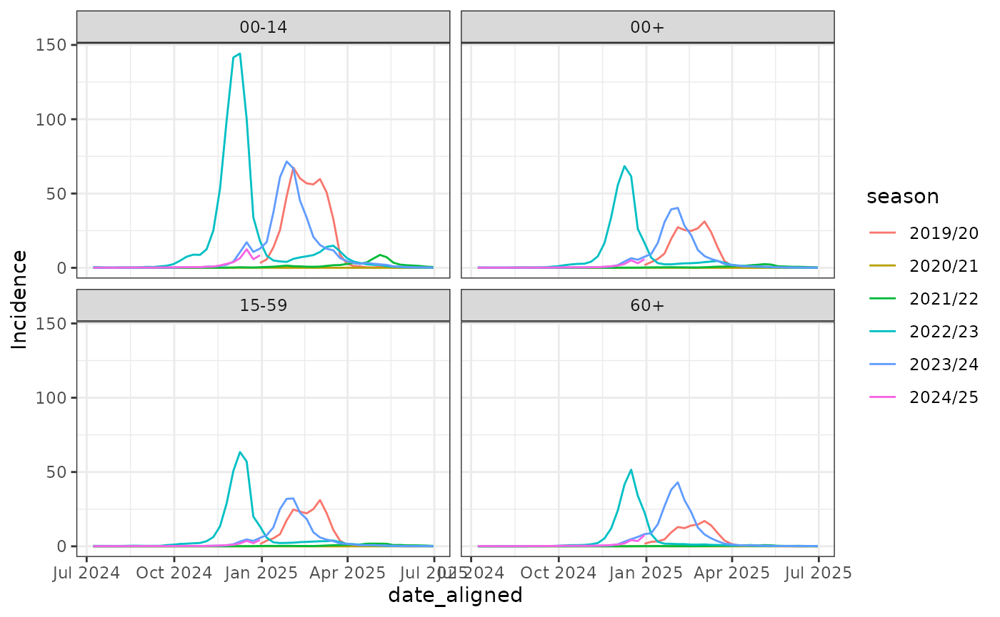
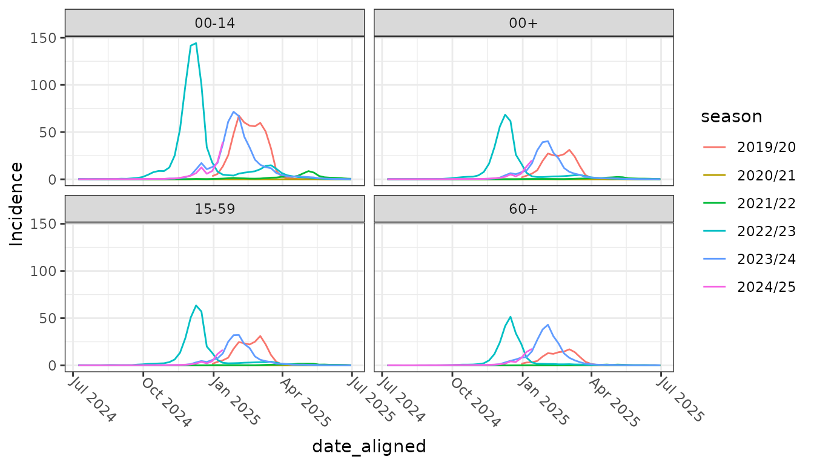
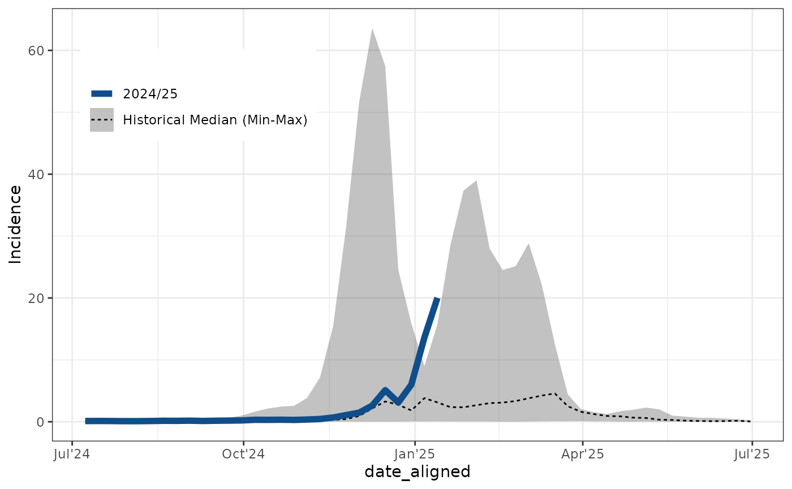
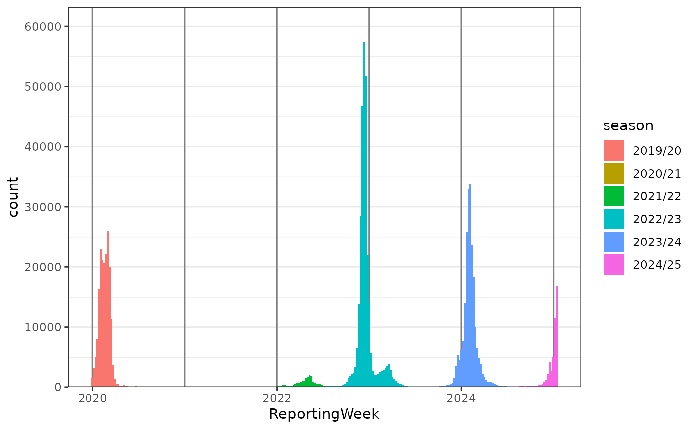

# Seasonal Plots: Align case data for seasonal analysis

## The seasonal plot

This vignette is still work in progress. But the examples are hopefully
already helpful and inspiring.

The seasonal plot is a commonly used plot for seasonal respiratory
pathogens like Influenza and RSV. For seasons covering the turn of the
year the new yearly breakpoint has to defined (e.g. week 28 instead week
1 for new year). In a second step the previous seasons have to be
aligned to the current season to allow the seasonal comparison. Here we
show how this is automated using `ggsurveillance`.



## Seasonal alignment and plot

``` r
library(ggplot2)

influenza_germany |>
  align_dates_seasonal(
    dates_from = ReportingWeek, date_resolution = "isoweek", start = 28
  ) -> df_flu_aligned

ggplot(df_flu_aligned, aes(x = date_aligned, y = Incidence, color = season)) +
  geom_line() +
  facet_wrap(~AgeGroup) +
  theme_bw() +
  theme_mod_rotate_x_axis_labels_45()
```



``` r
influenza_germany |>
  align_dates_seasonal(dates_from = ReportingWeek) |>
  group_by(AgeGroup, season) |>
  tally(wt = Cases) |>
  pivot_wider(names_from = AgeGroup, values_from = n)
#> # A tibble: 6 × 5
#>   season   `00+` `00-14` `15-59` `60+`
#>   <chr>    <dbl>   <dbl>   <dbl> <dbl>
#> 1 2019/20 186788   58628   96769 30596
#> 2 2020/21    683     132     267   283
#> 3 2021/22  18980    7176    9580  2206
#> 4 2022/23 299167   93343  149590 55944
#> 5 2023/24 217235   57544   97617 61879
#> 6 2024/25  48427   12438   22063 13882
```

## Combining everything for the seasonal plot

``` r
influenza_germany |>
  filter(AgeGroup == "00+") |>
  align_dates_seasonal(
    dates_from = ReportingWeek,
    date_resolution = "isoweek",
    start = 28
  ) -> df_flu_aligned

ggplot(df_flu_aligned, aes(x = date_aligned, y = Incidence)) +
  stat_summary(
    aes(linetype = "Historical Median (Min-Max)"),
    data = . %>% filter(!current_season),
    fun.data = median_hilow, geom = "ribbon", alpha = 0.3
  ) +
  stat_summary(
    aes(linetype = "Historical Median (Min-Max)"),
    data = . %>% filter(!current_season),
    fun = median, geom = "line"
  ) +
  geom_line(
    aes(linetype = "2024/25"),
    data = . %>% filter(current_season), colour = "dodgerblue4", linewidth = 2
  ) +
  labs(linetype = "") +
  scale_x_date(date_labels = "%b'%y") +
  theme_bw() +
  theme(legend.position = c(0.2, 0.8))
```



## Other visualisations

``` r
influenza_germany |>
  filter(AgeGroup != "00+") |>
  align_dates_seasonal(dates_from = ReportingWeek) |>
  ggplot(aes(x = ReportingWeek, weight = Cases, fill = season)) +
  geom_vline_year(color = "grey50") +
  # Use stat = count for more efficient plotting
  geom_epicurve(color = NA, stat = "count") +
  scale_y_cases_5er() +
  theme_bw()
```


